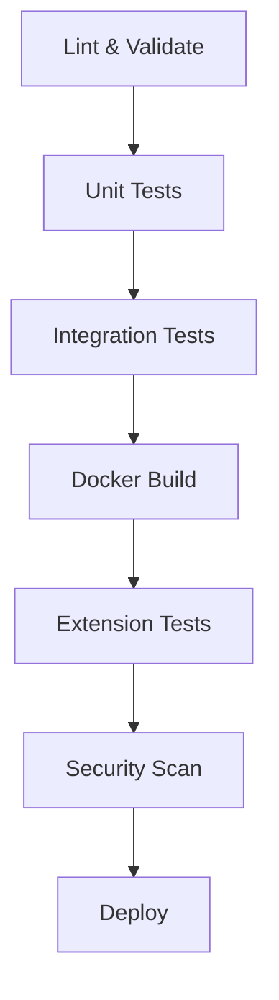

# Testing Infrastructure

Generated by Copilot (GPT-4o), 2025-08-30

This directory contains the comprehensive testing infrastructure for the VS Code Debian Slim Docker build system. The tests are organized into multiple categories to ensure thorough validation of all system components.

## 📁 Directory Structure

```text
tests/
├── run_tests.sh                 # Master test runner script
├── package.json                 # Test dependencies and npm scripts
├── docker-compose.test.yml      # Docker Compose test configuration
├── configs/                     # Test configuration files
│   ├── test_config.yaml        # Primary test configuration
│   └── test_yaml_config.yaml   # Secondary test configuration
├── integration/                 # Integration tests
│   ├── test_build_script.sh    # Main integration test suite
│   └── test_build_script.sh.backup # Backup of test script
├── unit/                       # Unit tests
│   └── unit_tests.sh           # Shell script unit tests
└── extension/                  # VS Code extension tests
    └── extension.test.ts       # TypeScript extension tests
```

## 🚀 Quick Start

### Run All Tests

```bash
# From the tests directory
./run_tests.sh

# Or from project root
tests/run_tests.sh
```

### Run Specific Test Types

```bash
./run_tests.sh unit          # Unit tests only
./run_tests.sh integration   # Integration tests only
./run_tests.sh extension     # VS Code extension tests only
./run_tests.sh security      # Security tests only
```

### Advanced Options

```bash
./run_tests.sh --verbose all     # Verbose output
./run_tests.sh --parallel all    # Parallel execution
./run_tests.sh --no-cleanup all  # Keep test artifacts
```

## 📋 Test Categories

### 1. Unit Tests (`unit/`)

- **Purpose:** Test individual functions and components
- **Scope:** Shell script functions, YAML parsing, Docker utilities
- **Runtime:** ~30 seconds
- **Dependencies:** bash, basic Unix utilities

**Key Tests:**

- YAML configuration parsing
- Docker container name generation
- Logging function validation
- Error handling mechanisms

### 2. Integration Tests (`integration/`)

- **Purpose:** Test complete build system workflows
- **Scope:** Full Docker build process, VS Code tunnel setup, security analysis
- **Runtime:** ~5-15 minutes
- **Dependencies:** Docker, shellcheck, build scripts

**Key Tests:**

- Complete container build process
- Shell script syntax validation
- YAML configuration validation
- Docker container functionality
- Tunnel creation and detection

### 3. Extension Tests (`extension/`)

- **Purpose:** Test VS Code extension functionality
- **Scope:** TypeScript compilation, extension packaging, API integration
- **Runtime:** ~1-2 minutes
- **Dependencies:** Node.js, npm, VS Code extension tools

**Key Tests:**

- Extension activation and loading
- Log parsing functionality
- Configuration management
- File system operations
- Command registration

### 4. Security Tests (Built into `run_tests.sh`)

- **Purpose:** Security validation and vulnerability scanning
- **Scope:** Secret detection, shell script security, YAML validation
- **Runtime:** ~1 minute
- **Dependencies:** shellcheck, optional yamllint

**Key Tests:**

- ShellCheck security analysis
- Secret pattern detection
- YAML file validation
- File permission verification

## 🔧 Test Configuration

### Test Configurations (`configs/`)

**`test_config.yaml`** - Primary test configuration:

```yaml
tunnel_name: test_yaml_mode
force_analysis: false
logging: true
copilot_is_autonomous: false
test_mode: true
```

**`test_yaml_config.yaml`** - Debug test configuration:

```yaml
tunnel_name: test_tunnel_debug
force_analysis: false
logging: true
auto_update_on_start: true
```

### Docker Compose Testing

Use the provided Docker Compose configuration for isolated testing:

```bash
# Build and test in isolated environment
docker-compose -f docker-compose.test.yml up --build

# Run specific test services
docker-compose -f docker-compose.test.yml run test-runner
docker-compose -f docker-compose.test.yml run security-scanner
```

## 🔄 GitHub CI/CD Integration

### Workflows Overview

The testing infrastructure integrates seamlessly with GitHub Actions through multiple workflows:

#### 1. **Main CI/CD Pipeline** (`.github/workflows/ci-cd.yml`)

**Trigger Events:**

- Push to `main` or `develop` branches
- Pull requests to `main`
- Weekly security scans (Sundays 2 AM UTC)

**Test Stages:**



**Key Features:**

- Multi-architecture Docker builds (amd64, arm64)
- Automated artifact uploads
- Security vulnerability scanning
- Extension packaging and distribution

#### 2. **Security Pipeline** (`.github/workflows/security.yml`)

**Comprehensive Security Analysis:**

- **SAST:** CodeQL static analysis
- **Dependencies:** npm audit, Snyk scanning
- **Secrets:** TruffleHog detection
- **IaC Security:** Checkov infrastructure scanning
- **Container Security:** Dockle linting, structure tests

**Automated Reporting:**

- Security summary generation
- SARIF upload to GitHub Security tab
- Pull request security comments

### Setting Up CI/CD

#### Required GitHub Secrets

```bash
# Optional for enhanced security scanning
SNYK_TOKEN=your_snyk_token_here
```

#### Branch Protection Rules

Recommended settings for `main` branch:

- ✅ Require status checks to pass
- ✅ Require up-to-date branches
- ✅ Include administrators
- Required status checks:
  - `Lint and Validate`
  - `Unit Tests`
  - `Integration Tests`
  - `Docker Build and Test`
  - `Security Analysis`

#### Auto-merge Configuration

For automated dependency updates:

```yaml
# .github/dependabot.yml
version: 2
updates:
  - package-ecosystem: "npm"
    directory: "/vscode-container-updater"
    schedule:
      interval: "weekly"
    reviewers:
      - "your-github-username"
    assignees:
      - "your-github-username"
```

## 🐛 Debugging Test Failures

### Common Issues and Solutions

#### 1. **Shell Script Failures**

```bash
# Check syntax manually
bash -n script_name.sh

# Run with debugging
bash -x script_name.sh

# Check ShellCheck recommendations
shellcheck script_name.sh
```

#### 2. **Docker Build Issues**

```bash
# Build with verbose output
docker build --no-cache --progress=plain .

# Check Docker daemon
docker system info

# Clean Docker cache
docker system prune -a
```

#### 3. **Extension Test Failures**

```bash
# Clean and reinstall dependencies
cd vscode-container-updater
rm -rf node_modules package-lock.json
npm install

# Check TypeScript compilation
npm run compile

# Manual extension packaging
npx @vscode/vsce package --allow-missing-repository
```

#### 4. **Permission Issues**

```bash
# Fix script permissions
find tests/ -name "*.sh" -exec chmod +x {} \;

# Check file ownership
ls -la tests/
```

### Log Analysis

**Test logs are stored in:** `logs/`

- `test-run-{timestamp}.log` - Integration test logs
- `unit-test-{timestamp}.log` - Unit test logs
- `test-runner-{timestamp}.log` - Master test runner logs

**Log Parsing Commands:**

```bash
# Find recent test failures
grep -r "ERROR\|FAIL" logs/ | tail -20

# Show test summary
grep -r "TEST SUMMARY" logs/ | tail -5

# Check specific test results
tail -f logs/test-run-$(ls -t logs/test-run-*.log | head -1 | cut -d'-' -f3-)
```

## 📊 Test Metrics and Reporting

### Performance Benchmarks

| Test Type | Expected Duration | Failure Threshold |
|-----------|------------------|-------------------|
| Unit Tests | < 30s | 0% |
| Extension Tests | < 2m | 0% |
| Security Tests | < 1m | 0% |
| Integration Tests | < 15m | 0% |
| Full Test Suite | < 20m | 0% |

### Coverage Goals

- **Shell Scripts:** 100% syntax validation via ShellCheck
- **TypeScript:** Compilation + packaging verification
- **Docker Builds:** Multi-architecture support
- **Security:** Zero high/critical vulnerabilities
- **Configuration:** All YAML files validated

## 🔮 Future Enhancements

### Planned Improvements

1. **Enhanced Test Coverage**
   - VS Code extension runtime tests
   - Performance benchmarking
   - Load testing for container builds

2. **Advanced CI/CD Features**
   - Automatic dependency updates
   - Performance regression detection
   - Test result analytics dashboard

3. **Security Enhancements**
   - SBOM (Software Bill of Materials) generation
   - License compliance checking
   - Advanced container scanning

4. **Developer Experience**
   - Pre-commit hooks integration
   - Local development container
   - Test result visualization

## 📚 Additional Resources

- [GitHub Actions Documentation](https://docs.github.com/en/actions)
- [Docker Best Practices](https://docs.docker.com/develop/dev-best-practices/)
- [VS Code Extension Testing](https://code.visualstudio.com/api/working-with-extensions/testing-extension)
- [Security Scanning Tools](https://github.com/analysis-tools-dev/static-analysis)

---

For questions or issues with the testing infrastructure, please check the logs or open an issue in the repository.
